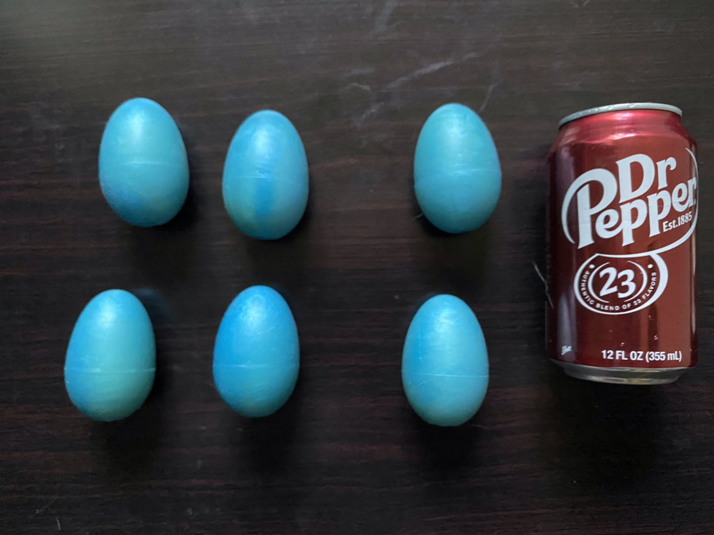
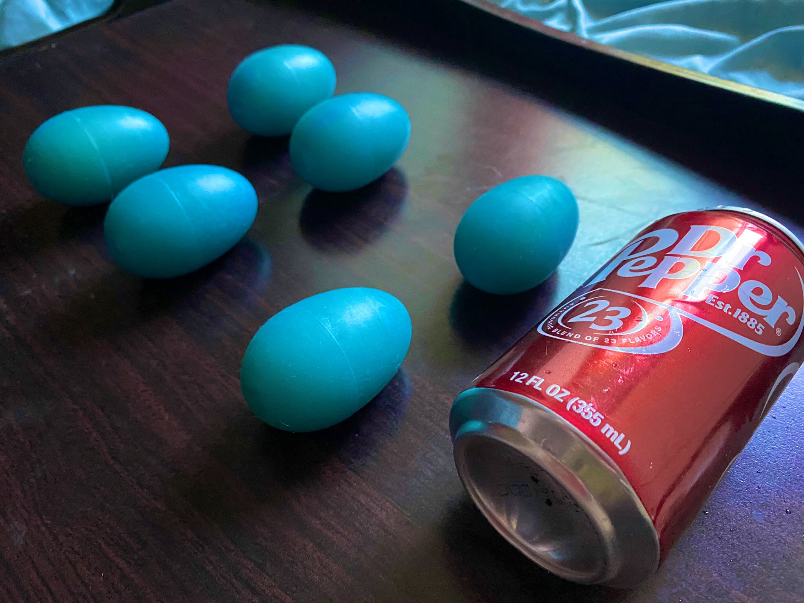

## Summary

|                  |          |
| ---------------- | -------: |
| UV Reactive      | No       |
| Glow in the Dark | No       |
| Custom           | Yes      |
| Price            | 60-70    |
| Ordered          | Jan 2018 |
| Rating           | 9/10     |

### Images

## Positives

Let me preface this by saying I absolutely love these eggs. They were one of my first toys from an indie seller.

#### Ordering Process
When I ordered this I used very vague terms (I didn’t know how to word it better) and I believe it was earlier on in akrowsnest's selling career. They responded very quickly and worked with me to figure out what I wanted; ocean themed eggs.
If I can remember correctly it took maybe a week at the time to show me the results and they were blue *for sure*. I wanted a little more color in terms of the depths of the blues, but I honestly had no complaints! 

#### Feel
These roughly chicken sized eggs are very soft, squishy, and smooth inserting. They are the perfect size eggs for me. The eggs are actually round, without the big flat bottom most egg sellers have.
The eggs feel fantastic vaginally inserted. They are squishy enough that when inserting them they kind of squish into whatever space they can fit in... It’s **fantastic**. 

## Negatives

#### Seam

The eggs have this big seam on it that I CANNOT STAND.
Their current eggs still have this seam unfortunately and appears to be an issue with their mold.
It’s so hard to show off my favorite eggs when they have this big fat seam on them.

#### Discoloration
Also over the last two-three years of having them the color has really had some significant discoloration.
I’ve never stored them in sunlight, but they maybe for a day or so one time came in contact with a shitty pvc toy.
None of my other toys have this color distortion issue. 

## Conclusion

I wish it didn’t have the seam and I wish the colors had deeper depth. But overall, fantastic price and ABSOLUTELY THE BEST EGGS.

### Rating: 9/10